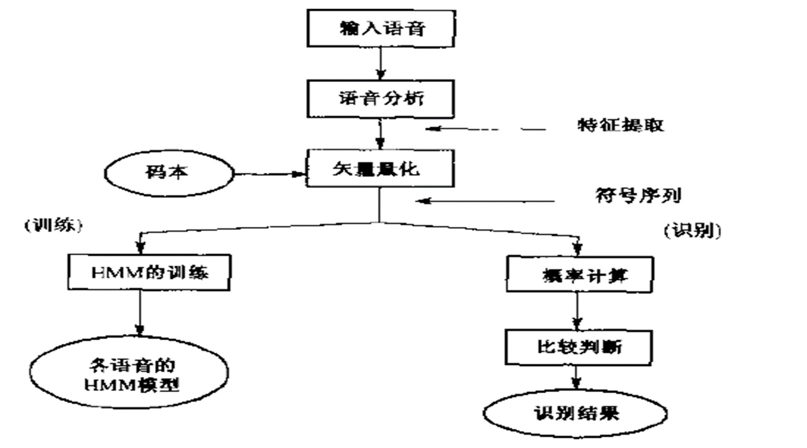

**HMM处理三种问题，我理解为三种功能**： 
-  给出 O (可观测序列o1 o2 o3... ot），求P(O | hmm)
-  给出 O，求出使P(O, H | hmm)最大的 H （H为与O对应的隐藏层时序序列）
-  给出 O，求出使P(O | hmm) 最大的 hmm（参数调整） 

**HMM应用于孤立词语音识别流程描述**： 

（训练：功能三）
1. 给出a, b, c三个词的音频库（Wa, Wb, Wc）,对音频库的所有样本进行特征提取。（这里以mfcc为例），对每一段音频 w 先分成若干帧[w1,w2, w3...wn]，对每一帧提取mfcc,获得[mfcc1,mfcc2,mffcc3...mfcc_n]。
2. 对这些mfcc进行聚类处理(比如k-means)，获得M个类（类中心），每个类对应一个HMM的可观测层，同时将所有的mfcc进行分类，转化为可观测层的状态，该mfcc归到哪个类就对应哪个可观测状态。（矢量量化）对每一段音频w的mfcc串[mfcc1,mfcc2,mffcc3...mfcc_n]，就会获得它的可观测序列[o1, o2, o3...on]
3. 从而获取了词汇 a ，b ，c 的所有O 序列，记为Oa，Ob，Oc；（Ox表示词汇x的所有样本的可观测层序列向量组成的矩阵）
4. 基于上述的HMM的第三个功能，以Oa，Ob，Oc作为条件，分别获得三个HMM，记为HMMa，HMMb，HMMc；

（识别：功能一）

5. 给出一段孤立词x的音频，对他提取mfcc串,对提取出的mfcc串使用上面聚类的中心进行分类，进而转化为可观测序列记为ox；
4. 基于HMM的第一个功能，将 ox 输入到HMMa，HMMb，HMMc中获得三个概率，记为Pa，Pb，Pc；
5. 比较Pa，Pb，Pc,获取最大的Py(y = a 或 b 或 c ）
6. x = y;
 

**HMM  + GMM** 
上述孤立词识别使用的是离散型的HMM，即可观测层的状态个数是有限的（M个中心，所以是M个），因此对于mfcc这种连续的高维特征，必须要做矢量量化，但也因此引入了量化误差，所以提出使用连续性HMM。 
首先说明一个概念，其实任何一个隐层状态到可观测状态的概率向量，都可以看成是一个概率分布。所以连续型的HMM把每个隐层状态到可观测层的概率分布都看成是一个GMM分布。

$$b_j(X) = \sum_{m=1}^{M}w_{jm}*N(X|\mu_{jm}, Σ_{jm} )$$
其中N表示高维正态分布（高斯分布）。
X 就直接使用高维特征，比如mfcc。

但是这样带来的问题是，大量的参数引入，使得计算的复杂量很高，同时在数据量不足时，发挥不出优势；所以又提出了半连续型HMM，即：
$$b_j(X) = \sum_{m=1}^{M}w_{jm}*N(X|\mu_{m}, Σ_{m} )$$
也就是所有的\\(b_j(X)\\)分布共享一套高斯函数，只是分歧系数w有所不同。

**HMM7 目录** 
HMM7目录下的就是上面所说的实现了三种功能和孤立词识别流程的离散HMM的简单实现。